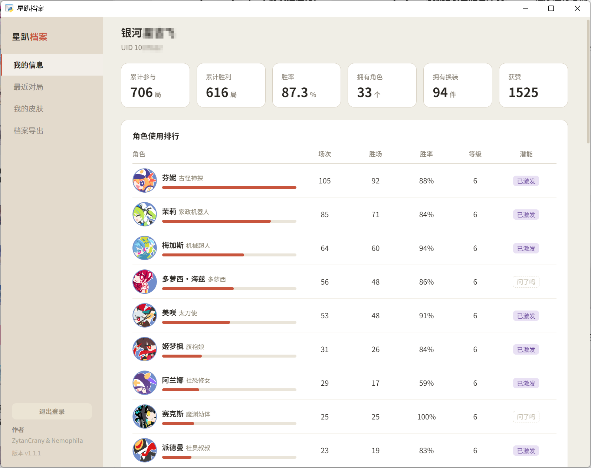
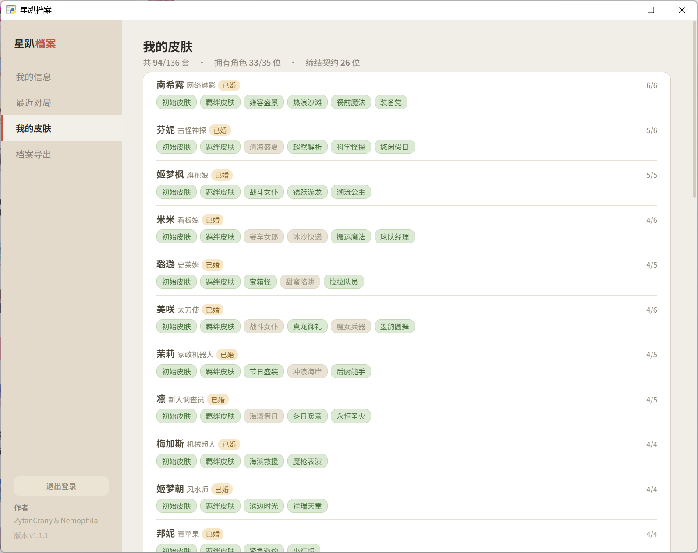
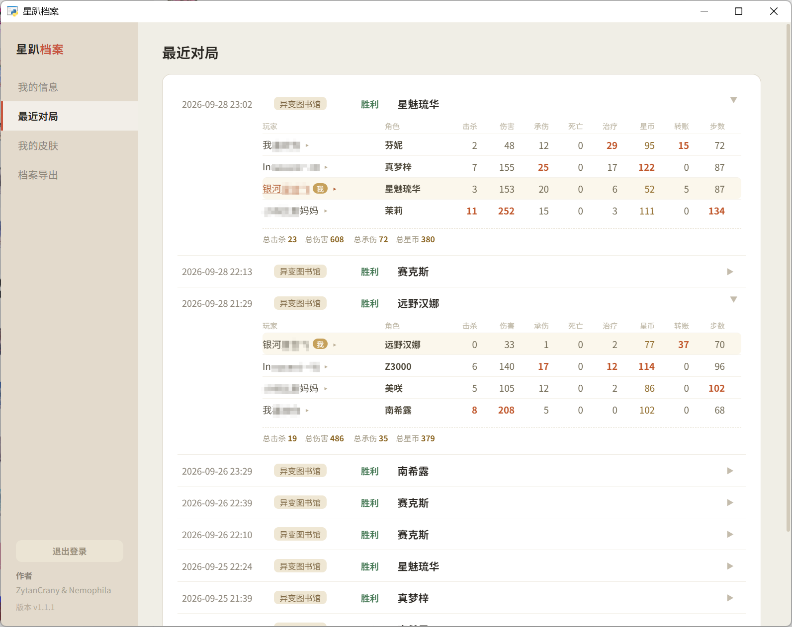
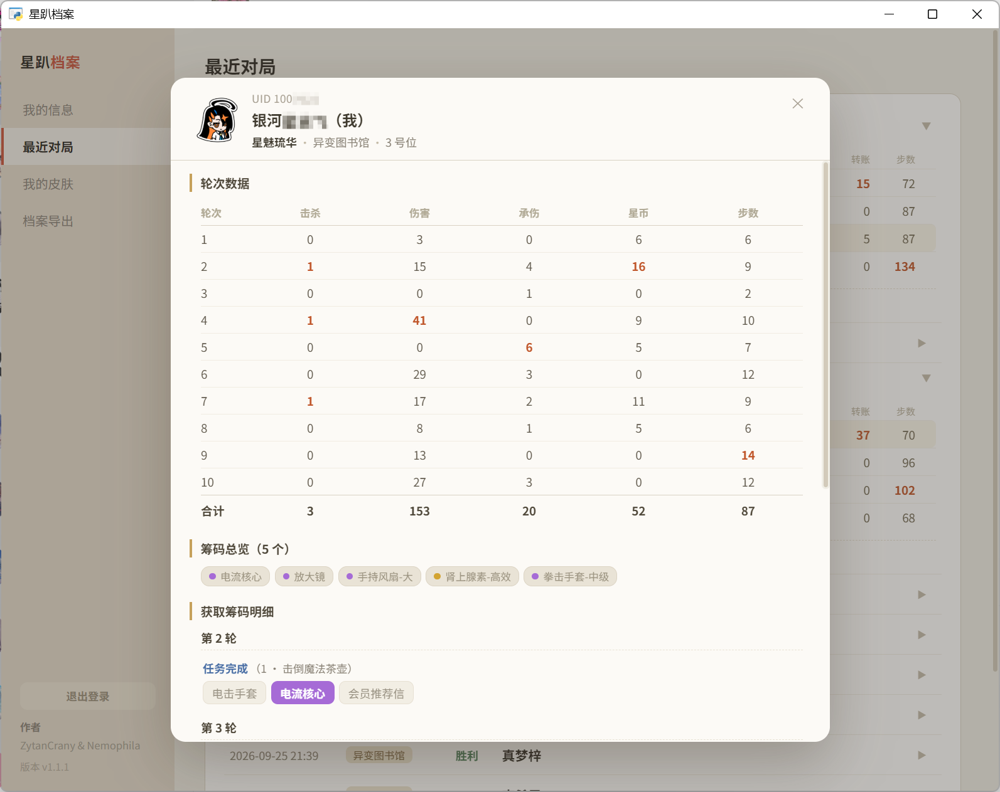
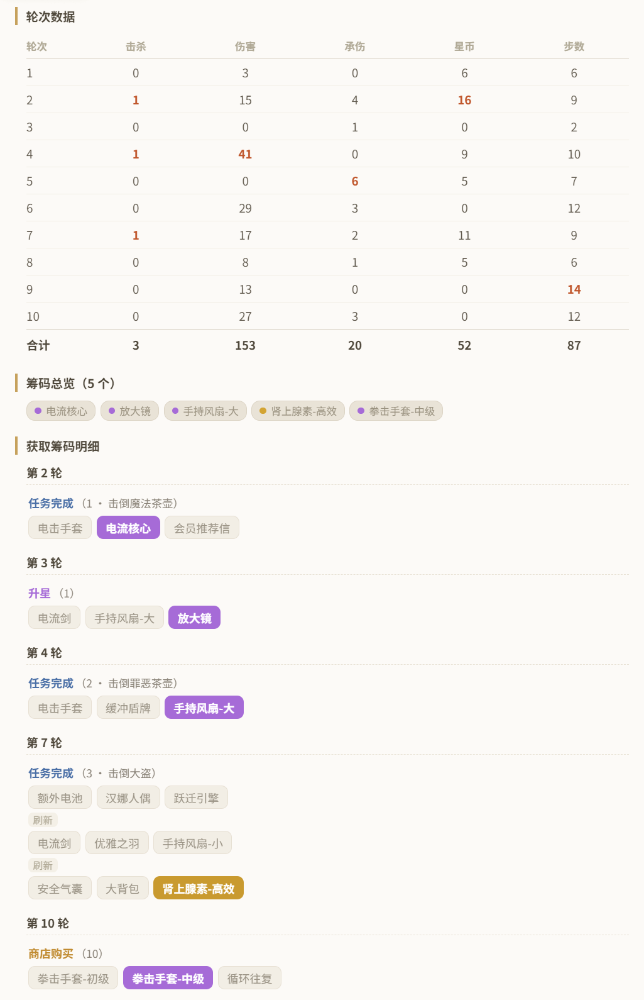
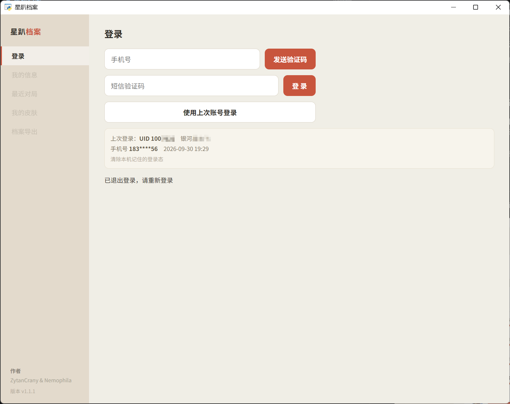

# AstralParty_Dex

**星趴档案** ｜ 中文 README → [README.md](README.md)

> 《Astral Party》(CN server「吉星派对」)
> Authors: **Nemophila & ZtyanCrany** ｜ Version **v1.1.1**

A tidy self-service tool: log in with your own account, then browse your full profile, skin
collection and recent matches — click any match to see each player's **round-by-round summary
and relic pickups**.
**All data is processed on your own machine.**

---

## ✨ Features

| Page | What you get |
| --- | --- |
| **Login (登录页面)** | SMS-code login; the session can be remembered for automatic login next time |
| **My Profile (我的信息)** | Level, total matches / wins / win-rate, owned characters, skins, likes, character usage ranking |
| **My Skins (我的皮肤)** | Every skin of every character, owned or not, with bond status, level and potential |
| **Recent Matches (最近对局)** | The latest 10 matches; expand one to see all four players' stats, click a player name for their per-round summary and relic pickups |
| **Export (档案导出)** | One-click Markdown archive (usage ranking + match details), copy it or save to a file |

### 🎲 Replay Breakdown (new in v1.1.0)

Click a player name inside 「Recent Matches」 to open that player's replay window:

- **Round stats** — per-round **kills / damage / damage taken / gold / steps**; a round in which
  they died is marked right after damage taken as「(×_×;)」
- **Relic overview** — which relics were picked up in that match
- **Relic pickup log** — grouped by round, with the source labelled (quest completion / star-up /
  shop purchase / cycle), showing which relic was chosen out of the three choices and what came
  up **before and after a reroll**

---

## 📷 Screenshots

**My Profile** — level / matches / win-rate / owned characters & skins / likes / usage ranking



**My Skins** — every skin of every character, owned or not, with bond status / level / potential



**Recent Matches** — the latest 10 matches, expandable to all four players' full stats



**Replay Breakdown** — click a player name inside a match to open it





**Login**



---

## 🚀 Quick start

### Option A — prebuilt, no installation (recommended)

1. Download `AstralParty_Dex_vX.Y.Z_win64.zip` from **Releases**
2. Extract anywhere
3. Run `星趴档案.exe`
4. The first run shows the login page → phone number → SMS code → log in
5. The login state is remembered; next time you go straight to your profile

> **Requirements**: Windows 10 / 11 64-bit.
> The UI needs the system **WebView2 runtime** (bundled with Win11; on Win10 usually installed
> together with Edge). If the window comes up blank, install the WebView2 Runtime from Microsoft.

### Option B — from source

```bash
python -m pip install -r requirements.txt
python main.py
```

On Windows you can also simply **double-click `run_source.bat`** (it starts the app through `pythonw`, so no console window is left behind).

---

## 📁 Project layout

```
AstralParty_Dex/
├─ main.py                  Entry point (pywebview UI; data assembly, export, review cache)
├─ astral/                  Core library
│   ├─ paths.py             Path resolution: read-only assets vs writable data (source / frozen)
│   ├─ sign.py              SDK signature algorithm + send code / login
│   ├─ signkeys.py          Channel signing keys extracted from the game client
│   ├─ sdk_login.py         Session handling, handshake, full-profile parsing
│   ├─ client.py            Game server protocol client (framing / send / receive / routing)
│   ├─ frame.py             Protocol frame codec (35-byte big-endian header + protobuf payload)
│   ├─ keytable.py          The client's 256-byte permutation table (decryption)
│   ├─ proto_loader.py      Build protobuf messages from assets/proto/*.pb
│   ├─ replay.py            Replay parsing (room snapshot stream + packet records)
│   ├─ review.py            Replay build (per-round diffs, relic source detection, 3-choice chains)
│   └─ gameart.py           ★ Runtime extraction of avatars / portraits from the local game
├─ ui/app.html              Front-end (plain HTML/CSS/JS, no framework)
├─ assets/
│   ├─ app.ico / app.png    App icon
│   ├─ data/                Read-only data tables (character_ids · heroes · skins · potential · missions · chips)
│   └─ proto/               Protocol descriptors (FileDescriptorProto)
├─ tools/                   Data pipeline + game asset extraction + one-click packaging scripts
└─ userdata/                Generated at runtime: login state, replay cache, extracted avatars
```

## ⚠️ Disclaimer

- This project is for **learning and research** purposes only; it is not affiliated with the
  game's developer or publisher in any way.
- All game data, character designs and names are copyrighted by their respective rights holders.
- Please do not use it for commercial purposes or large-scale scraping; any consequences of using
  this project are borne by the user.
- If the official side considers this project inappropriate, please contact us and it will be
  removed.
- `astral/signkeys.py` holds channel signing keys extracted from the game client (client-side
  constants, not any user's credentials). It is kept in a single file so that, should it ever be
  needed, **deleting that file** stops the distribution while the signature algorithm, protocol
  and UI themselves are unaffected.

---

## 🔧 Building

```bash
python -m pip install pyinstaller
python tools/build_exe.py       # → dist/星趴档案/星趴档案.exe (copy it together with _internal/ to run)
python tools/make_release.py    # → AstralParty_Dex_vX.Y.Z_win64.zip (version read from main.py)
```

`make_release.py` **deletes `userdata/` from the artifact** before zipping (it holds a
password-less login state — shipping it would mean shipping the account), then **re-opens the
archive to verify** that no `userdata/` / `token.json` slipped in; it also verifies that **no game
artwork made it into the package** (avatars / portraits are extracted at runtime from the locally
installed game, so the package contains none).
If you have run the exe inside `dist/星趴档案/` by hand, it will have created a `userdata/` —
remember to re-package or delete it manually.

### Diagnostics (the packaged app has no console, so errors are not displayed)

The program writes avatar-extraction logs and exceptions into `<next to the exe>\userdata\log.txt`;
there is also a self-test entry point:

```bash
dist\星趴档案\星趴档案.exe --selftest     # checks dependency imports / multiprocessing / game asset location / test-scan + decode one texture
```

The self-test result is written to `userdata\log.txt` as well (last line `问题: [...]`; empty = all good).
There are two known pitfalls in resource collection at packaging time (both already fixed in
`tools/build_exe.py`, don't revert them): `--collect-all UnityPy` drags in torch/pandas and
inflates the package to GB scale, while **leaf dependency data files** such as `archspec`'s json
and `fmod_toolkit`'s `fmod.dll` will make every single texture fail to decode if not collected.

---

## 📜 Changelog

See [CHANGELOG.md](CHANGELOG.md).

---

## 💛 Credits

- Data sources: the official game client and the 吉星派对 Wiki
