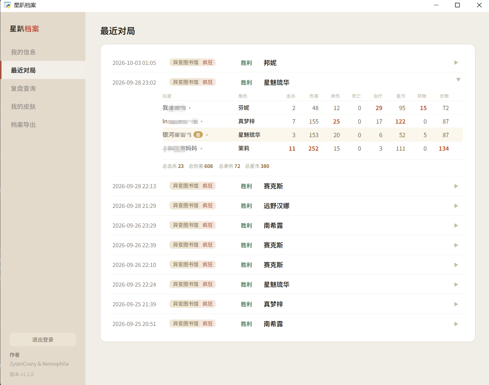
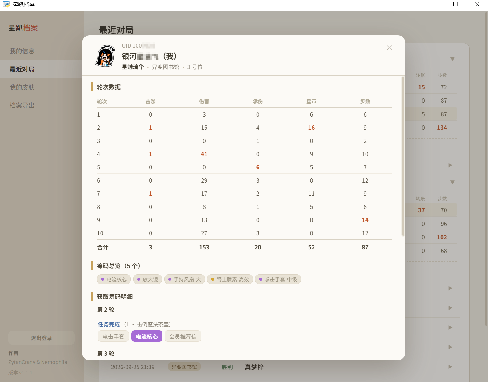
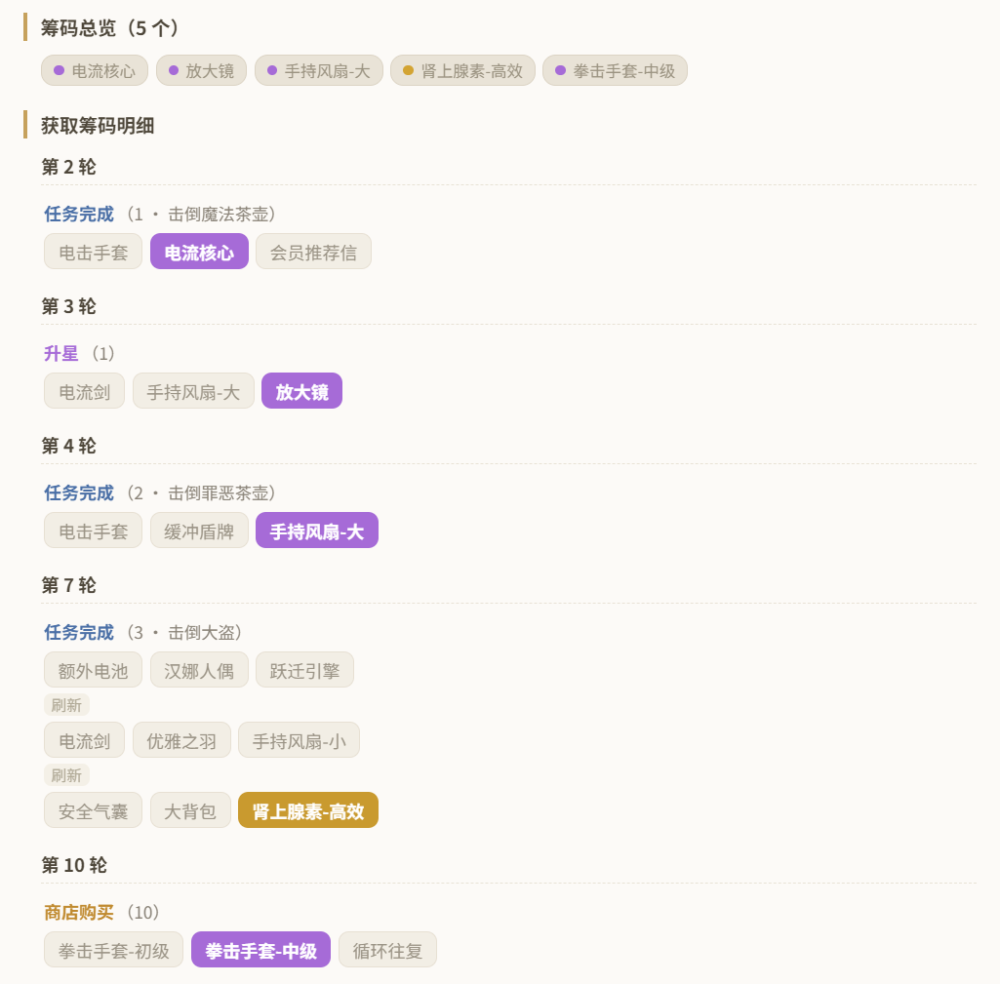
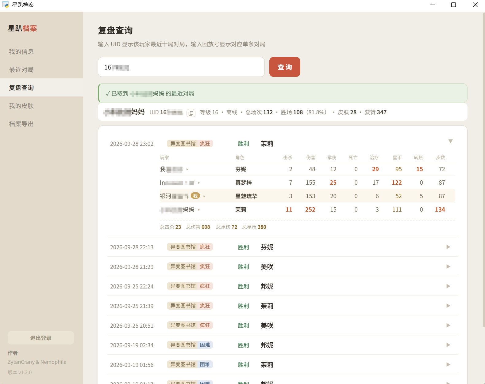
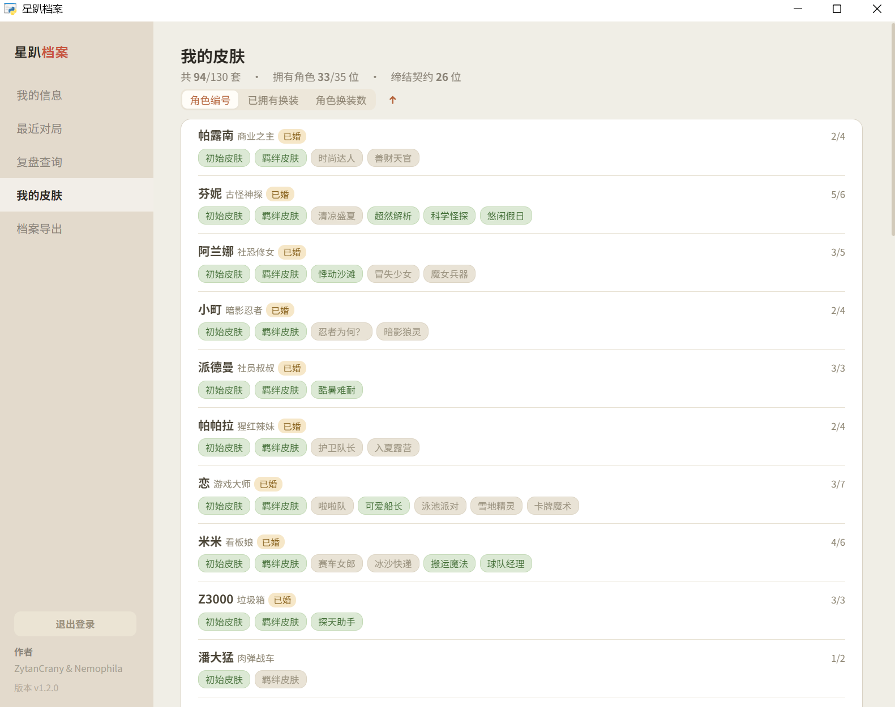

# 星趴档案

**AstralParty_Dex** ｜ English README → [README.en.md](README.en.md)

> 《星引擎 Party》《Astral Party》（国服又名「吉星派对」）
> 作者：Nemophila & ZytanCrany ｜ 版本 v1.2.1

一个简洁的自助小工具：登录账号，查看账号信息、皮肤和最近对局战绩，根据uid或回放号查询战局，
点开任意一局可逐位玩家看**逐轮战况简报与筹码拿取明细**。
所有数据在本地主机处理，游戏本体美术资源通过本机游戏资源获取。

---

## ✨ 特性

| 页面 | 内容 |
| --- | --- |
| **登录页面** | 支持手机号+验证码/密码登录，支持Steam、Bilibili和TapTap渠道登录；可记住登录态实现自动登录 |
| **我的信息** | 等级、累计场次 / 胜场 / 胜率、拥有角色、皮肤数、获赞数、角色使用排行 |
| **我的皮肤** | 按角色列出全部皮肤，标注已拥有 / 未拥有、羁绊状态 |
| **最近对局** | 最近 10 局，展开看四位玩家的战绩表，点击玩家名查看每轮战况与拿取筹码明细 |
| **复盘查询** | 输入**回放号**或**玩家 UID** 可查：回放号看单局，UID 看该玩家最近10局对局 |
| **档案导出** | 一键生成 Markdown 档案（含角色使用排行 + 对局明细），可复制或保存为文件 |

### 🎲 对局复盘（v1.1.0 新增，v1.2.0 补上难度与等级）

在「最近对局」里**点击玩家名字**可弹出该玩家的复盘窗口：


- **轮次数据** —— 逐轮的**击杀 / 伤害 / 承伤 / 星币 / 步数**；该轮阵亡会在承伤后标「(×_×;)」
- **筹码总览** —— 这局拿了哪些筹码
- **获取筹码明细** —— 按轮次分块，标明来源（ 任务完成 / 升星 / 商店购买 /  循环往复），
  展示三选一时选了哪件筹码、以及**刷新前后**出了哪些筹码

### 🔍 复盘查询（v1.2.0 新增）

侧边栏的「复盘查询」只有一个输入框，自动识别你要查什么：

- **回放号** —— 打开那一局的完整记录，四位玩家的逐轮战况与筹码明细都能展开
- **玩家UID** —— 列出该玩家最近10局，点任意一局可看复盘信息

---

## 📷 项目截图

**我的信息** —— 等级 / 场次 / 胜率 / 拥有角色皮肤 / 获赞 / 角色使用排行


**最近对局** —— 最近 10 局，展开看四位玩家的完整战绩表



**对局复盘** —— 在「最近对局」里**点击玩家名字**弹出





**复盘查询** —— 输入回放号或玩家 UID，查单局或该玩家最近 10 局



**我的皮肤** —— 按角色列出全部皮肤，标注已拥有 / 未拥有、羁绊状态



**登录页面**


---
## 🚀 快速开始

### 方式一：下载免安装版（推荐）

1. Releases 下载 `AstralParty_Dex_vX.Y.Z_win64.zip`
2. 解压到任意位置
3. 双击 `星趴档案.exe`
4. 第一次会看到登录页 → 填手机号 → 收短信验证码 → 登录
5. 登录成功后会记住登录态，以后打开直接进入档案页

> **运行环境**：Windows 10 / 11 64 位。
> 界面依赖系统的 **WebView2 运行时**（Win11 自带；Win10 一般随 Edge 一并安装）。
> 如果启动后白屏，去微软官网装一下 WebView2 Runtime 即可。

### 方式二：源码运行

```bash
python -m pip install -r requirements.txt
python main.py
```

Windows 上也可以直接**双击 `run_source.bat`**（内部用 `pythonw` 静默启动，不留控制台黑窗口）。

---

## 📁 项目结构

```
星趴档案/
├─ main.py                  主程序（pywebview 入口；数据组装、导出、复盘缓存）
├─ astral/                  核心库
│   ├─ paths.py             路径解析：区分只读资源与可写数据（源码 / 打包双模式）
│   ├─ sign.py              SDK 签名算法 + 发送验证码 / 登录
│   ├─ sdk_login.py         登录态管理、握手包获取与全量档案解析
│   ├─ client.py            游戏服务器协议客户端（帧封装 / 收发 / 路由）
│   ├─ frame.py             协议帧编解码（35 字节大端头 + protobuf 载荷）
│   ├─ keytable.py          客户端内置的 256 字节置换表（解密用）
│   ├─ proto_loader.py      从 assets/proto/*.pb 构造 protobuf 消息
│   ├─ replay.py            回放文件解析（房间快照流 + 协议包记录）
│   ├─ review.py            复盘构建（逐轮差分、筹码来源判定、三选一链）
│   └─ gameart.py           ★ 运行时从本机游戏资源包提取头像 / 立绘头像
├─ ui/app.html              前端界面（原生 HTML/CSS/JS，无框架）
├─ assets/
│   ├─ app.ico / app.png    应用图标
│   ├─ data/                只读数据表（character_ids · heroes · skins · potential · missions · chips）
│   └─ proto/               协议描述符（FileDescriptorProto）
├─ tools/                   数据管线脚本 + 游戏资源提取 + 一键打包脚本
└─ userdata/                运行时生成：登录态、回放缓存、提取出的头像
```

## ⚠️ 免责声明

- 本项目仅供**学习与研究**使用，与游戏开发方、运营方无任何关联。
- 所有游戏数据、角色形象、名称的版权归原权利方所有。
- 请勿用于任何商业用途或大规模数据抓取；因使用本项目产生的任何后果由使用者自行承担。
- 若官方认为本项目不妥，请联系删除。
- `astral/signkeys.py` 里是从游戏客户端提取的**渠道签名密钥**（属客户端常量，**不涉及任何用户凭据**）；单独放一个文件，是为了一旦需要，**删除该文件**即可停止分发，而签名算法、协议与界面本身不受影响。

---

## 🔧 构建

```bash
python -m pip install pyinstaller
python tools/build_exe.py       # → dist/星趴档案/星趴档案.exe（连同 _internal/ 一起拷走即可运行）
python tools/make_release.py    # → AstralParty_Dex_vX.Y.Z_win64.zip（版本号自动读 main.py 里的 VERSION）
```

`make_release.py` 打 zip 前会**删掉产物里的 `userdata/`**（里面是免密登录态，混进去等于把账号一起发出去），
打完后还会**开包复核**一遍，确认没有 `userdata/` / `token.json` 才放行；
同时复核**美术资源没有进包**（角色头像 / 立绘改为运行时从本机游戏资源包提取，包里不含）。
如果你手动在 `dist/星趴档案/` 里跑过 exe，它会生成 `userdata/`，记得重新打包或手动删掉。

### 排查（打包后没有控制台，异常不会显示）

程序会把头像提取的日志与异常写进 `<exe 旁>\userdata\log.txt`；另有一个自检入口：

```bash
dist\星趴档案\星趴档案.exe --selftest     # 逐项检查依赖导入 / 多进程 / 游戏资源定位 / 试扫 + 解码一张贴图
```

自检结果同样写进 `userdata\log.txt`（末尾一行 `问题: [...]`，为空即全部正常）。
打包时的资源收集有两个已知坑（都已在 `tools/build_exe.py` 里修好，别改回去）：
`--collect-all UnityPy` 会拖进 torch/pandas 把包撑到 GB 级；而 `archspec` 的 json、
`fmod_toolkit` 的 `fmod.dll` 这类**叶子依赖的数据文件**不收全，贴图就一张都解不出来。

---

## 📜 更新日志

见 [CHANGELOG.md](CHANGELOG.md)。

---

## 💛 致谢

- 数据源：官方客户端与吉星派对Wiki
